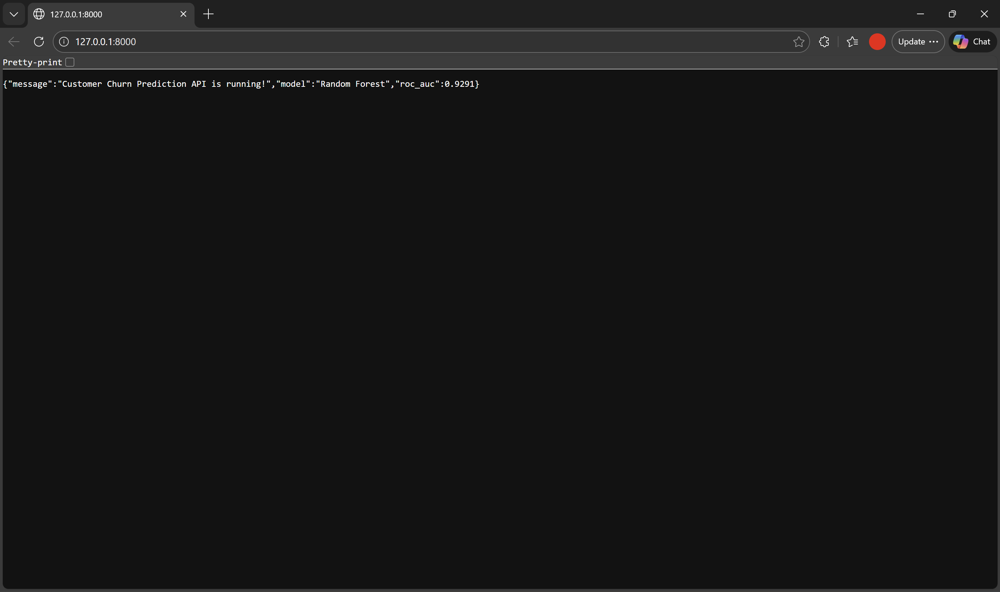
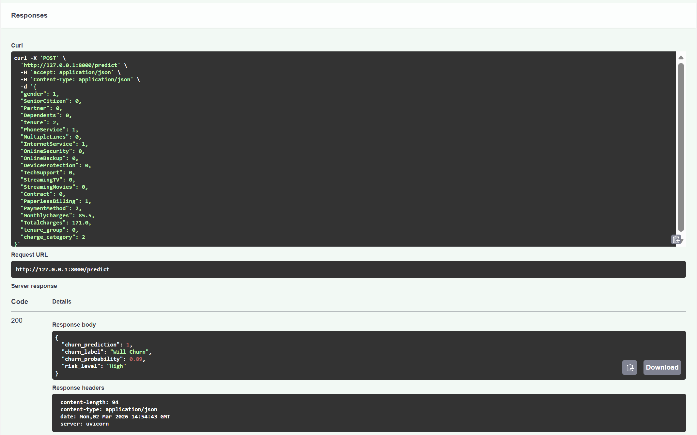
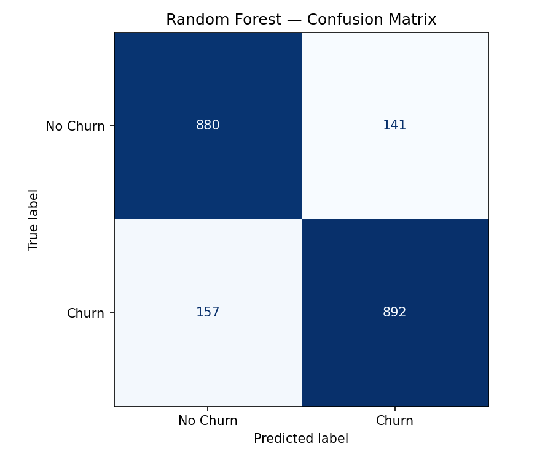
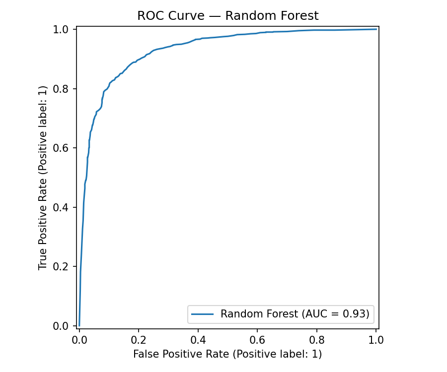
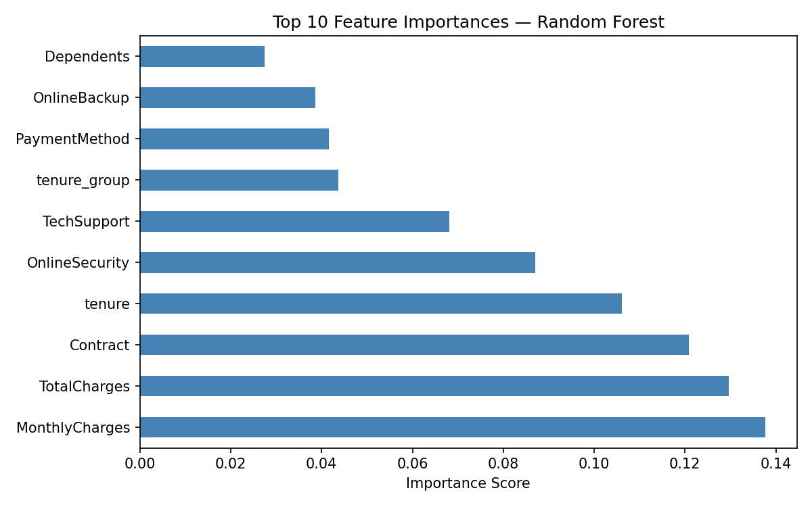

# 🔮 Customer Churn Prediction | Machine Learning + FastAPI Deployment

> **End-to-End ML Pipeline for Telecom Customer Churn Prediction — from raw data to deployed REST API. Built with Random Forest, XGBoost, Logistic Regression, SMOTE balancing, and served via FastAPI.**


---

## 🔎 Project Overview

A complete Machine Learning pipeline that predicts customer churn for a telecom company — from raw data ingestion to a **deployed REST API with live predictions**.

**Best Model: Random Forest | ROC-AUC: 0.93 | Accuracy: 86%**

### Full Pipeline Flow
```
Raw Data → Clean & Engineer Features → Train ML Models
     → Evaluate & Select Best Model → Save Model
          → Deploy FastAPI → Live Prediction Endpoint
```

---

## 🚀 API Demo





**Live Prediction Example:**
```json
POST /predict
→ Response:
{
  "churn_prediction": 1,
  "churn_label": "Will Churn",
  "churn_probability": 0.89,
  "risk_level": "High"
}
```

---

## 💼 Business Impact

> *"The model identifies 85% of churning customers before they leave. For a telecom company with 10,000 customers at $70/month average, preventing even 10% of predicted churners saves approximately $700,000 in annual revenue."*

This is not just a prediction model — it's a **revenue protection tool**.

---

## 🎯 Business Problem

Customer churn is one of the most costly problems in subscription-based businesses. Acquiring a new customer costs 5–7x more than retaining an existing one.

**Without a churn model, businesses:**
- React only after customers have already left
- Apply retention offers blindly to all customers (wasteful)
- Miss early warning signals hidden in customer behavior data

**With this model, businesses can:**
- Identify at-risk customers weeks before they churn
- Target retention offers only to high-risk customers
- Prioritize account management resources effectively

---

## 🗂 Dataset Information

| Field | Details |
|---|---|
| Source | Telco Customer Churn (Kaggle / IBM Sample) |
| Records | 7,043 rows × 21 columns |
| Target | Churn (Yes/No → 1/0) |
| Class Distribution | 73.5% No Churn / 26.5% Churn (imbalanced) |
| Features | Demographics, services, contract, billing information |

---

## 🐍 ML Pipeline Steps

### Data Cleaning
- Converted `TotalCharges` from object to numeric — found **11 hidden null values**
- Filled nulls with median imputation
- Dropped `customerID` (non-predictive identifier)
- Encoded target variable: `Yes → 1`, `No → 0`

### Feature Engineering
- Created `tenure_group` — bucketed customer tenure into 5 lifecycle stages
- Created `charge_category` — segmented MonthlyCharges into Low/Medium/High/Very High
- Label encoded all categorical variables

### Class Imbalance Handling
- Applied **SMOTE (Synthetic Minority Oversampling Technique)** to balance classes
- Before SMOTE: 5,174 No Churn vs 1,869 Churn
- After SMOTE: 5,174 vs 5,174 — perfectly balanced

```python
smote = SMOTE(random_state=42)
X_resampled, y_resampled = smote.fit_resample(X, y)
```

---

## 🤖 Models Trained & Compared

| Model | ROC-AUC | Accuracy | Precision | Recall |
|---|---|---|---|---|
| Logistic Regression | 0.8951 | 81% | 0.81 | 0.81 |
| XGBoost | 0.9273 | 84% | 0.84 | 0.84 |
| **Random Forest** | **0.9291** | **86%** | **0.86** | **0.86** |

**Winner: Random Forest** with ROC-AUC of 0.9291

---

## 📊 Model Evaluation

### Confusion Matrix


- **True Positives (Churn correctly identified): 892**
- **True Negatives (No Churn correctly identified): 880**
- False Positives: 141 | False Negatives: 157

### ROC Curve


AUC = 0.93 — significantly above random baseline (0.50). The curve hugs the top-left corner indicating strong discrimination ability.

### Feature Importance


**Top Predictors of Churn:**
1. `MonthlyCharges` — highest billing = highest churn risk
2. `TotalCharges` — lifetime value indicator
3. `Contract` — month-to-month contracts churn most
4. `tenure` — newer customers churn more
5. `OnlineSecurity` — customers without security services churn more

---

## 🌐 FastAPI Deployment

The trained model is deployed as a **REST API** using FastAPI with automatic Swagger documentation.

### API Endpoints

| Method | Endpoint | Description |
|---|---|---|
| GET | `/` | API status and model info |
| POST | `/predict` | Predict churn for a customer |
| GET | `/health` | Health check |

### Run the API

```bash
pip install fastapi uvicorn
uvicorn app:app --reload
```

API runs at: `http://127.0.0.1:8000`
Interactive docs at: `http://127.0.0.1:8000/docs`

### Sample API Request

```python
import requests

customer = {
    "gender": 1, "SeniorCitizen": 0, "Partner": 0,
    "Dependents": 0, "tenure": 2, "PhoneService": 1,
    "MultipleLines": 0, "InternetService": 1,
    "OnlineSecurity": 0, "OnlineBackup": 0,
    "DeviceProtection": 0, "TechSupport": 0,
    "StreamingTV": 0, "StreamingMovies": 0,
    "Contract": 0, "PaperlessBilling": 1,
    "PaymentMethod": 2, "MonthlyCharges": 85.5,
    "TotalCharges": 171.0, "tenure_group": 0,
    "charge_category": 2
}

response = requests.post("http://127.0.0.1:8000/predict", json=customer)
print(response.json())
# Output: {"churn_prediction": 1, "churn_label": "Will Churn",
#          "churn_probability": 0.85, "risk_level": "High"}
```

### Load Saved Model for Inference

```python
import joblib
model = joblib.load('churn_model.pkl')
scaler = joblib.load('scaler.pkl')
prediction = model.predict(scaler.transform(new_data))
```

---

## 💡 Key Business Insights

- **Price Sensitivity**: MonthlyCharges is the #1 churn driver — high-bill customers need proactive value communication
- **Contract Type Matters**: Month-to-month contract customers are highest risk — incentivize annual contracts
- **Early Tenure is Critical**: New customers (0-12 months) churn most — invest in onboarding experience
- **Security Services Retain**: Customers with OnlineSecurity and TechSupport churn significantly less
- **85% Recall on Churn**: Model catches 85% of actual churners — highly actionable for retention teams

---

## 📌 Management Recommendations

| Insight | Recommended Action |
|---|---|
| High MonthlyCharges = high churn | Offer loyalty discounts to customers paying >$65/month |
| Month-to-month contracts churn most | Create incentives for customers to upgrade to annual contracts |
| New customers (0-12 months) at risk | Launch structured 90-day onboarding and check-in program |
| No OnlineSecurity = churn risk | Bundle security services in retention offers |
| Top 15% churn probability customers | Assign dedicated account managers for proactive outreach |

---

## 🔄 Future Enhancements

- Hyperparameter tuning with GridSearchCV for further accuracy improvement
- Cloud deployment on AWS EC2 / Heroku for public API access
- Build customer risk scoring dashboard in Power BI connected to API
- Integrate with CRM system for automated at-risk alerts
- Implement model monitoring for drift detection in production
- Add authentication layer (API keys) for production security

---

## 🛠 Tools & Technologies

- **Python** — End-to-end ML pipeline
- **pandas, numpy** — Data manipulation and feature engineering
- **scikit-learn** — Model training, evaluation, preprocessing
- **XGBoost** — Gradient boosting classifier
- **imbalanced-learn (SMOTE)** — Class imbalance handling
- **matplotlib, seaborn** — Model evaluation visualization
- **FastAPI + Uvicorn** — REST API deployment
- **joblib** — Model serialization and persistence

---

## 📂 Project Structure

```
customer-churn-prediction/
│
├── telco_churn.csv               # Raw dataset
├── Project 3.py                  # Complete ML pipeline script
├── app.py                        # FastAPI deployment application
├── churn_model.pkl               # Saved Random Forest model
├── scaler.pkl                    # Saved StandardScaler
├── confusion_matrix.png          # Model evaluation visual
├── roc_curve.png                 # ROC-AUC curve
├── feature_importance.png        # Top 10 feature importances
├── api_home.png                  # API running screenshot
├── api_demo.png                  # Swagger UI demo screenshot
└── README.md                     # Project documentation
```

---

## ▶️ How to Run

**Train the model:**
```bash
pip install pandas numpy scikit-learn xgboost imbalanced-learn matplotlib seaborn joblib
python "Project 3.py"
```

**Run the API:**
```bash
pip install fastapi uvicorn
uvicorn app:app --reload
# Visit http://127.0.0.1:8000/docs
```

---

## 👤 Author

**Syed Kafeel Ahamed**

Finance professional with 6+ years of accounting experience transitioning into Data Analytics, leveraging domain expertise to build business-driven analytical solutions.

🔗 [LinkedIn](https://www.linkedin.com/in/syed-kafeel-ahamed-ab465036b) | [GitHub](https://github.com/ahamedkafeel22)
